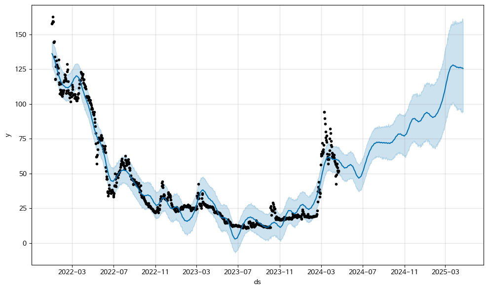
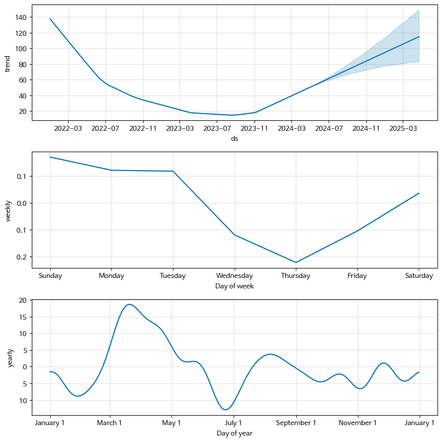

## Polaris sharetech Road to BlockChain AI

## 개요

```
최근 폴라리스 오피스의 주식가격과 폴라리스 쉐어토큰의 상관관계를 알아보고
해당 내용의 뉴스 토픽 분석을 진행한다.

아울러 시계열 머신러닝을 통해 앞으로의 토큰 가격을 예상해보고 미래 전략에 대해 알아본다.
```

## 결론

[최종 보고서](https://docs.google.com/presentation/d/1q89uSEslWp1AvbcVDwEit3KO1EywVichYd2ALYba3K0/edit#slide=id.p)

### 시계열 예측 모델

- 사용 모델 : facebook.prophet

- LDA 분석에서 나온 결론으로 AI와 관련된 블록체인 사업전략을 영위하였을 시 토큰 가격은 우상향 할 것이다.





```
부가적 분석으로 토큰은 주중보다는 주말 부근에서 더 긍정적인 거래가 많이 일어났고, 
지난 2023년 동안 4월에 매우 많이 올랐다가 6월에 최저치를 찍었다.
그리고 다시 그 이후부터 다시 우상향 하는 중이다.
```


## 토픽 추출 모델

```
- 사용 모델 : sklearn.LatentDirichletAllocation
- 평가 모델 : gensim.coherencemodel
- Tokenizer : Okt
- Vectorizer : sklearn.TfidfVectorizer
```

